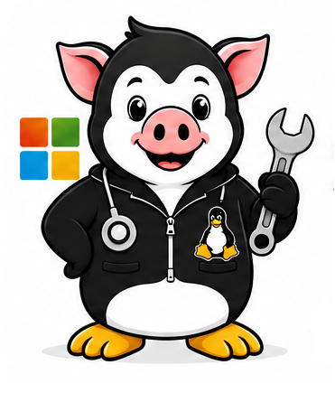

# Dr.Swinux — portable AI doctor for computers

<p align="center">
  
</p>

**Dr.Swinux** is a portable AI doctor for computers powered by Codex.

The idea is not to put Codex into a folder and add a collection of diagnostic scripts. Codex provides the intelligence; **Dr.Swinux provides the environment that lets that intelligence examine, understand, treat and re-check a particular computer.**

The user should be able to connect Dr.Swinux to a computer, launch it and describe a real problem or goal in ordinary language. The doctor then starts working on that machine: forms hypotheses, decides what evidence is needed, observes the system, rejects or refines hypotheses, performs allowed actions when necessary and verifies the original symptom or goal afterwards.

The target interaction is simple:

> Describe what is wrong or what you need. Dr.Swinux investigates the computer, finds a solution, performs allowed actions and checks the result.

## Why not just run Codex?

Codex is the reasoning engine. Dr.Swinux is the computer-doctor environment around it.

A generic agent can execute commands and reason about their output. Dr.Swinux is intended to add a persistent and platform-aware layer between that intelligence and the computer:

- a portable runtime that can be brought to another machine;
- structured ways to observe the operating system instead of relying only on an unrestricted shell;
- a growing set of reusable local tools discovered through real tasks;
- a controlled path for privileged operations while Codex itself stays unelevated;
- an autonomous investigation cycle rather than a collection of predefined diagnostic workflows;
- verification against the user's original problem after state-changing actions;
- reports and, ultimately, longitudinal knowledge of the particular computer: what was observed, what changed, why it changed and whether it helped;
- platform adapters that let the same doctor work with different operating systems without pretending that Windows, Linux and Android expose the same mechanisms.

In short:

**Codex is the intelligence of Dr.Swinux, not Dr.Swinux itself.**

## The doctor's working cycle

```text
user's symptom or goal
        ↓
understand the task
        ↓
form hypotheses
        ↓
choose the smallest useful observation
        ↓
gather local evidence
        ↓
confirm / reject / refine hypotheses
        ↓
choose an action when justified
        ↓
execute through the appropriate capability
        ↓
verify the original symptom or goal
        ↓
continue if the problem is not solved
```

The list of hypotheses is not supposed to be hardcoded. The model reasons about the actual task and actual machine.

Diagnostics are therefore only one possible activity. Dr.Swinux may investigate a failure, configure something, install or remove supported software, inspect applications and system components, correct an allowed setting, collect evidence, or perform another computer task for which it has a safe capability.

## Tools follow real problems

Dr.Swinux is not developed by inventing hundreds of narrow workflows in advance.

A real task drives development. If the doctor decides that a particular observation or action is necessary and the platform cannot provide it, that is a real **capability gap**. A reusable capability can then be added, audited and tested on the task that exposed the gap.

The intended direction is:

`real task -> reasoning -> missing capability discovered -> generic capability added -> original task re-tested`

This keeps the doctor general-purpose. Tools provide senses and hands; they do not decide the diagnosis.

## Safety and execution authority

Reasoning authority and execution authority are deliberately separated.

Codex itself stays unelevated. It can reason freely and use the capabilities available to it, but privileged Windows operations go through a typed allowlisted Broker. State-changing actions retain the appropriate confirmation and are followed by verification.

Dr.Swinux does not give the model an unrestricted elevated shell.

This architecture is intended to allow useful autonomy without making administrator access the default execution environment of the AI.

## Memory of the computer

A mature Dr.Swinux should know more than the current command output. It should be able to build a local history of the machine, for example:

```text
computer
├── hardware
├── operating system
├── drivers
├── installed software
├── storage
├── network
├── services and system components
└── history
    ├── previous symptoms
    ├── observations
    ├── actions performed
    ├── reasons for those actions
    └── verification results
```

This would let the doctor compare a new problem with previous incidents and changes instead of treating every session as a completely unknown machine.

The history must remain evidence, not dogma: previous conclusions can guide hypotheses but current observations must still be checked.

## Portable and cross-platform

Portability means more than storing Codex on a USB drive. Dr.Swinux should bring its working environment and tools to an unfamiliar computer, determine what platform capabilities are available and begin examining that machine.

The common doctor loop belongs to the core. Operating-system-specific mechanisms belong to platform adapters.

```text
                 Dr.Swinux core
                      │
          ┌───────────┼───────────┐
          ↓           ↓           ↓
       Windows       Linux      Android
          │           │           │
       Broker        sudo      Android APIs
       winget     package mgr   optional bridge
       WMI/CIM      /proc
       Event Log    journal
```

Windows is the current supported reference implementation. Linux and Android remain planned until real runtimes are implemented and tested.

## Windows today

Launch the root shortcut `ASK-AGENT.cmd.lnk`. Dr.Swinux prepares its portable PowerShell/Codex environment inside the project folder. The project can run from its own folder on a computer, external drive or USB stick.

The user does not need to translate the problem into diagnostic commands or select a predefined workflow. The natural-language task is the starting point.

Current architecture:

```text
system/
  core/                 common doctor behavior and platform contract
  platform/
    windows/            current supported platform
    linux/              planned runtime
    android/             planned runtime
  assets/branding/      Dr.Swinux branding
```

## Development roadmap

Development is driven by real Windows tasks first. Architecture changes and new tools should have a concrete reason demonstrated by an actual task.

### Phase 1 — prove the Windows doctor loop

Use Dr.Swinux on varied real computers and real user problems. For every task, determine whether the doctor can autonomously move through hypothesis, observation, decision, action and verification. Fix generic reasoning/execution problems in the core and Windows-specific gaps in the Windows platform layer.

Success criterion: the user normally describes the goal once and Dr.Swinux can continue working without being manually walked through diagnostic commands.

### Phase 2 — make observations capability-driven

Gradually expose reusable, structured platform capabilities for evidence the doctor actually needs. Avoid task-specific workflows. Each capability should describe what it can observe or do, its requirements and its risk level so the agent can choose it during reasoning.

Success criterion: adding a capability expands what the doctor can solve rather than adding one hardcoded scenario.

### Phase 3 — close the action/verification loop

Make state-changing operations first-class typed capabilities with explicit preconditions, confirmation policy, execution result and post-action verification. The doctor should return to the user's original symptom after an action rather than assuming that a successful command means the problem is solved.

Success criterion: technical command success and actual task success are treated as different things.

### Phase 4 — build the machine record

Introduce a local machine identity and structured history for observations, incidents, actions and verification results. Keep raw evidence and conclusions distinguishable. Let new sessions retrieve relevant prior incidents without blindly reusing old diagnoses.

Success criterion: Dr.Swinux can answer questions such as “what changed since this last worked?” using evidence collected on that computer.

### Phase 5 — capability discovery and self-extension workflow

When a real task reaches a missing capability, record the gap precisely: what the doctor tried to learn or do, why existing capabilities were insufficient and what evidence would close the gap. Use those records to drive development of generic tools and platform adapters.

Success criterion: the project grows from observed limitations instead of an invented plugin catalogue.

### Phase 6 — harden portability

Exercise clean launches on unfamiliar Windows machines, removable media and different Windows configurations. Keep bootstrap, Codex authentication, updates, reports and local machine data separated correctly so moving the doctor does not accidentally mix machine-specific state.

Success criterion: connecting Dr.Swinux to another supported Windows computer is a normal operating mode rather than a special installation procedure.

### Phase 7 — extract the proven cross-platform core

Only after the Windows doctor loop has enough real-task evidence, identify which behavior is genuinely platform-independent. Keep reasoning, task lifecycle, capability contracts, evidence/history model and verification semantics in the core; keep OS mechanisms in adapters.

Success criterion: the common core contains proven abstractions rather than abstractions invented before a second platform exists.

### Phase 8 — Linux runtime

Implement the first real Linux adapter against the proven capability contract, starting with a narrow supported Linux baseline and real Linux tasks. Use native Linux evidence and package/service mechanisms rather than translating Windows commands mechanically.

### Phase 9 — Android runtime

Build an Android-specific runtime around the same doctor model where Android permits it. Android capabilities and privilege models must be treated as Android concepts; optional mechanisms such as Shizuku or root can extend capabilities but should not define the basic architecture.

## Development rule

The central rule of the project is:

> **Do not invent work for Dr.Swinux. Give it real work. When real work exposes a missing sense, hand or platform capability, improve the doctor and test the original problem again.**

Every code change is followed by audit. A change is not considered complete merely because it was written; it must survive the project's automated checks and, where the behavior depends on Windows, ultimately be exercised on a real Windows machine.

## Updates and repository

The repository is **`uah0/Dr.Swinux`**. The updater checks this repository before the first task prompt and verifies the GitHub Release asset digest before installation. Release packages are named `Dr.Swinux-v<version>-final.zip`.

**Windows: supported | Linux: planned | Android: planned**
